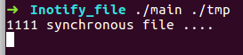
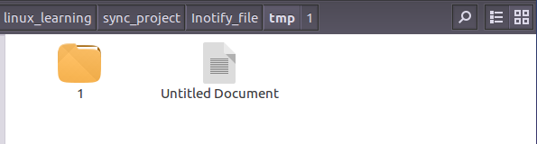

# 实时同步功能

## 1.功能描述

  软件自动监测目标S目录。当监测到目录中变化时，需要发起同步时，自动运行同步程序。

## 2.编译 执行命令说明
1. 代码编译
```bash
g++ Inotify.cpp Real_time_main.cpp -o main
```

2. 程序执行：运行时，需要一个监测目录路径作为参数(target path)。
```bash
./main $target path$
```

## 3.实现细节
本功能基于Linux核心子系统[inotify](https://www.man7.org/linux/man-pages//man7/inotify.7.html)实现。本工作将监控功能实现为一个监控Inotify类。关键的几个函数如下：

1. watch_init() 监控初始化: 初始化inotify，并将目录添加到监控列表中。
```C++
int Inotify::watch_init(int mask, char *root){
    if(fd == -1){
        fd = inotify_init();
        if (fd == -1) {
            cout<< "Error: inotify_init" << endl;
            return fd;
        }
    }
    add_watch(root, mask);
    return fd;
}
```

2. add_watch(): 将待监测的目录添加到inotify的监测列表中，这里需要注意的是，inotify只监测添加的目录下的文件变动，并不监测子文件下的文件变动，所以需要递归将子文件夹也添加到监测列表中。

```C++
void Inotify::add_watch(char *dir, int mask){
    char subdir[PATH_MAX_SIZE];
    DIR *odir;
    struct dirent *dent;

    if ((odir = opendir(dir)) == NULL){
        cout<< "dir: " << dir << endl;
        cerr << "Error: fail to open root dir" << endl;
        return;
    }

    int dir_wd;
    dir_wd = inotify_add_watch(fd, dir, mask);
    dirset.insert(make_pair(dir_wd, string(dir)));

    if (dir_wd == -1) {
        cerr << "Error: inotify_add_watch";
        close(fd);
    }

    errno = 0;
    while ((dent = readdir(odir)) != NULL)
    {
        if (strcmp(dent->d_name, ".") == 0 || strcmp(dent->d_name, "..") == 0)
            continue;
        if (dent->d_type == DT_DIR)
        {
            sprintf(subdir, "%s/%s", dir, dent->d_name);
            add_watch(subdir, mask);
        }
    }

    if (errno != 0)
    {
        cerr << "Error: fail to read dir"<<endl;
        exit(1);
    }
}
```
3. delete_watch_recursive(): 当文件夹被删除时，需要将该文件夹及其子文件都从监测列表中移除，由于被删除时，文件夹已经不存在，所以在实现时，从监测列表中使用字符串匹配出该删除的文件夹及其子文件夹。
```C++
bool Inotify::delete_watch(string prefix){
    map<int, string>::reverse_iterator iter;
    for(iter = dirset.rbegin(); iter != dirset.rend(); iter++){
        if(iter->second.find(prefix) == 0){
            int result = inotify_rm_watch(fd, iter->first);
            if (result == -1) {
                cerr << "Error: fail to remove watch." << endl;
                exit(1);
            }
            if(dirset.erase(iter->first) == 0){
                cerr << "Error: erase filed." << endl;
                exit(1);
            }
            return false;
        }
    }
    return true;
}

void Inotify::delete_watch_recursive(char* dir){
    string prefix = dir;
    while (true)
    {
        if(delete_watch(prefix))
            break;
    }
}
```

4. CallRsync(): 当文件夹发生需要变动时，需要调用同步程序，这里使用execl()进行调用，这里目前使用一个hello的程序作为示例。由于同步存在延迟，这里使用阻塞的方式，当同步程序运行完成后才继续查看文件变动状态。
```C++
void Inotify::CallRsync()
{
	pid_t pid = fork();
	if (pid < 0)
	{
		cout << "Error: failed to fork!" << endl;
	}
	else if (pid == 0)
	{
		//run the executable file
		if (execl("./hello", "./hello", "1111", NULL) < 0)
			cout << "Error: execl error!" << endl;
	}
	else
	{
		int status;
		if (wait(&status) == -1)
			cout << "Error: failed to wait!" << endl;
	}
}

```
5. watch_loop()：轮询监测，读取监测事件，主要读取的事件有：IN_MODIFY | IN_CREATE | IN_DELETE | IN_ISDIR | IN_MOVED_FROM | IN_MOVED_TO。在监测之前，需要先进行一次同步操作，保证一开始两个文件夹是一样的。当监测到以上事件时，需要进行同步操作。不过在进行同步操作之前，需要对监测的列表进行调整，避免遗落文件夹的变动事件。
```C++
void Inotify::watch_loop(){
    int len = 0;
    char buf[EVENT_BUFSIZE], *cur = buf, *end;

    // Rsync at first.
    CallRsync();

    while (true) {
        len = read(fd, cur, EVENT_BUFSIZE - len);
        if (len <= 0) {
            cerr << "Error: read inotify event";
            close(fd);
        }

        end = cur + len;

        while (cur + sizeof(struct inotify_event) <= end) {
            struct inotify_event* e = (struct inotify_event*)cur;

            if (cur + sizeof(struct inotify_event) + e->len > end)
                break;

            if (e->mask & IN_MOVED_FROM || e->mask & IN_DELETE) {
                if (e->mask & IN_ISDIR){
                    char new_dir[512];
                    sprintf(new_dir, "%s/%s", dirset.find(e->wd)->second.c_str(), e->name);
                    delete_watch_recursive(new_dir);
                }
            }
            
            if (e->mask & IN_CREATE || e->mask & IN_MOVED_TO) {
                if (e->mask & IN_ISDIR){
                    char new_dir[512]; 
                    sprintf(new_dir, "%s/%s", dirset.find(e->wd)->second.c_str(), e->name);
                    add_watch(new_dir, MASK);
                }
                
            }
            cur += sizeof(struct inotify_event) + e->len;
        }

        if (cur >= end) {
            cur = buf;
            len = 0;
        } else {
            len = end - cur;
            memmove(buf, cur, len);
            cur = buf + len;
        }

        CallRsync();
    }

    close(fd);
}
```

## 4.功能运行演示
1. 待监测目录：./tmp


2. 运行实时同步: 在监测到变动时，首先进行一次同步



3. 创建一个文件: 在监测到添加了新的文件时，进行一次同步




4. 删除一个文件: 在监测到删除了文件时，进行一次同步


5. 其他文件变动可以按照运行方式，进行尝试

## 5.测试

## 6.待完善功能
1. 添加配置文件
2. 目前的监测列表是不监测(.)和(..)文件，需要自定义配置
3. 目前监测事件是固定，需要自定义配置监测的事件


